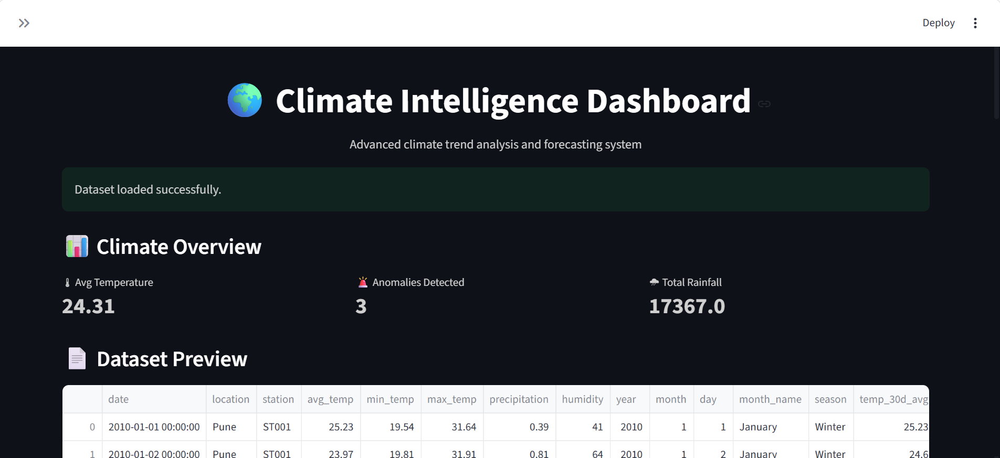
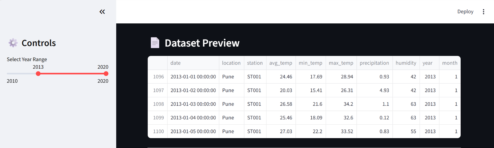
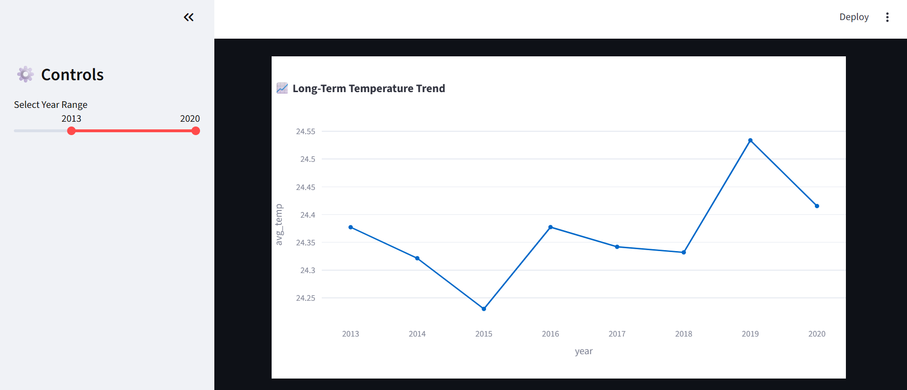
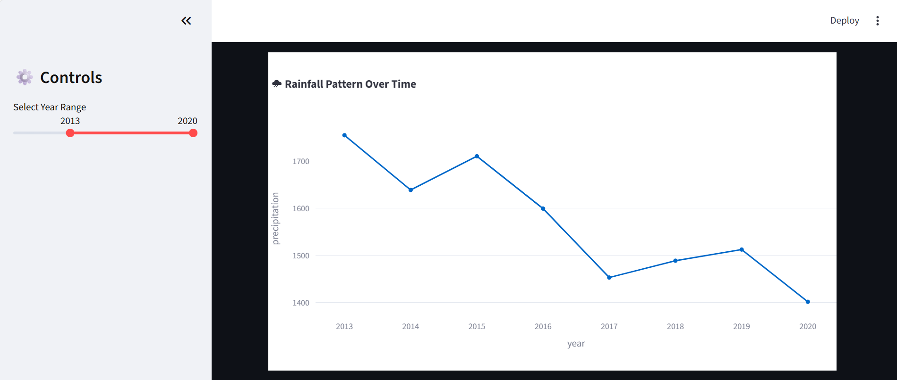
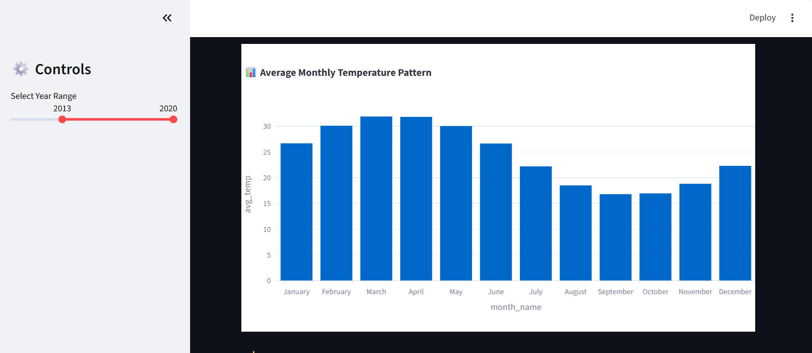
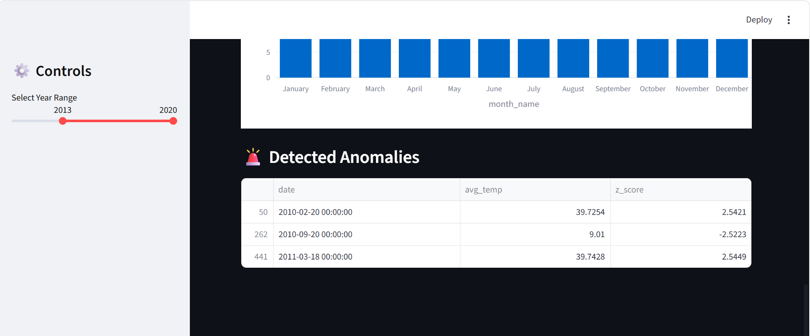
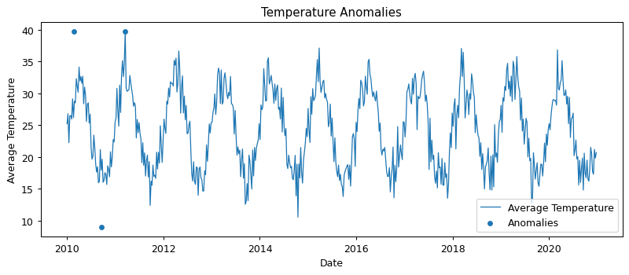

# 🌍 Climate Trend Analyzer

## 📌 Project Overview

The Climate Trend Analyzer is a data science project designed to analyze historical climate data, identify trends, detect anomalies, and forecast future temperature patterns using time-series analysis techniques.

---

## ❗ Problem Statement

Understanding climate change requires analyzing large datasets to identify patterns such as temperature rise, rainfall variation, and seasonal shifts. This project simulates and analyzes such patterns using synthetic climate data.

---

## 🌍 Industry Relevance

This project is relevant in domains such as:

* Environmental research
* Climate policy and governance
* Smart city planning
* Agriculture and energy sectors

---

## 💼 Business Value

* Helps detect abnormal climate behavior
* Supports climate-based decision making
* Predicts future environmental conditions
* Assists in sustainability planning

---

## 🛠️ Tech Stack

* Python
* Pandas, NumPy
* Plotly, Matplotlib
* Scikit-learn
* Statsmodels
* Streamlit

---

## 🏗️ Project Architecture

Data → Preprocessing → Feature Engineering → Trend Analysis → Anomaly Detection → Forecasting → Visualization

---

## 📂 Project Structure

Climate-Trend-Analyzer/
├── data/
├── src/
├── outputs/
├── images/
├── app/
├── main.py
└── README.md

---

## ⚙️ Installation

Install required libraries:

pip install -r requirements.txt

---

## ▶️ How to Run

Run the main pipeline:

python main.py

Launch the dashboard:

streamlit run app/streamlit_app.py

---

## 🔄 Simulation Workflow

This project uses a virtual simulation approach to replicate real-world climate behavior:

* Generate synthetic climate data (temperature, rainfall, humidity)
* Perform data preprocessing and feature engineering
* Analyze long-term climate trends
* Detect anomalies using statistical methods
* Forecast future temperature patterns

---

## 📊 Results

* Increasing temperature trends observed over years
* Rainfall variability patterns identified
* Climate anomalies detected successfully
* Future temperature trends forecasted

---

## 📸 Dashboard Screenshots

### 🌍 Dashboard Overview

### 📄 Dataset Preview

### 📈 Temperature Trend

### 🌧 Rainfall Trend

### 📊 Monthly Pattern

### 🚨 Anomalies

### Saved Charts

---

## 🚀 Future Improvements

* Multi-city climate comparison
* Real-time weather API integration
* Pollution vs climate analysis
* AI-based anomaly detection
* Satellite data integration

---

## 📚 Learning Outcomes

* Time-series data analysis
* Data preprocessing techniques
* Anomaly detection methods
* Forecasting techniques
* Dashboard development using Streamlit

---

## 👩‍💻 Author

Vaidehi Deore
